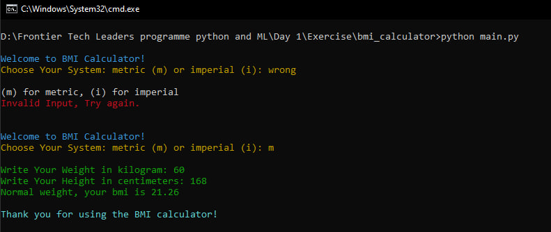

# BMI Calculator with Color Output 🌈

This is a simple command-line BMI (Body Mass Index) calculator written in Python.
The program calculates your BMI based on either the **metric** or **imperial** system and provides feedback with color-coded results for easy readability.
